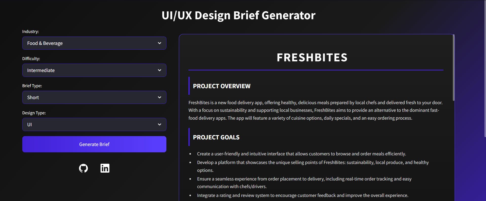

# UI/UX Design Brief Generator

A **Streamlit-based web app** that generates realistic design briefs for UI and UX projects.  
Perfect for **students, designers, and portfolio builders** who want practice with professional-style project prompts.



---

## ✨ Features
- 🔹 Select **Industry**, **Difficulty**, **Brief Type**, and **Design Type (UI/UX)**  
- 🔹 Always includes **Brand Identity** and **User Story** in the brief  
- 🔹 Clean **dark mode UI** with gradient styling  
- 🔹 Export generated briefs as **.txt files**   

---

## 🛠️ Tech Stack
- **Frontend / Framework**: [Streamlit](https://streamlit.io)  
- **AI Backend**: [Cohere API](https://cohere.com) (for generating briefs)  
- **Styling**: Custom CSS (dark theme + gradient accents)  
- **Language**: Python 3.10+  

---

## 📦 Installation & Setup

### 1. **Clone the repository**
   ```bash
   git clone https://github.com/your-username/uiux-brief-generator.git
   cd uiux-brief-generator
```

### 2. Install dependencies

```bash
pip install -r requirements.txt
```

### 3. Set your Cohere API key

Create a .env file. You can use other AI APIs too (like OpenAi, Claude, etc.) 
```env
COHERE_API_KEY=your-cohere-key-here
```

### 4. Run the app in terminal & Visit Local Host

```bash
python backend/app.py
```

---

## 📂 Folder Structure
```bash
├── app.py            # Main Streamlit app
├── generator.py      
├── style.css
├── requirements.txt
├── .env              # Store API key here
└── README.md
```
---

## 🙋‍♀️ Author
Built by Antara Srivastava
📧 antarakyw05@gmail.com
🌐 github.com/antarades
